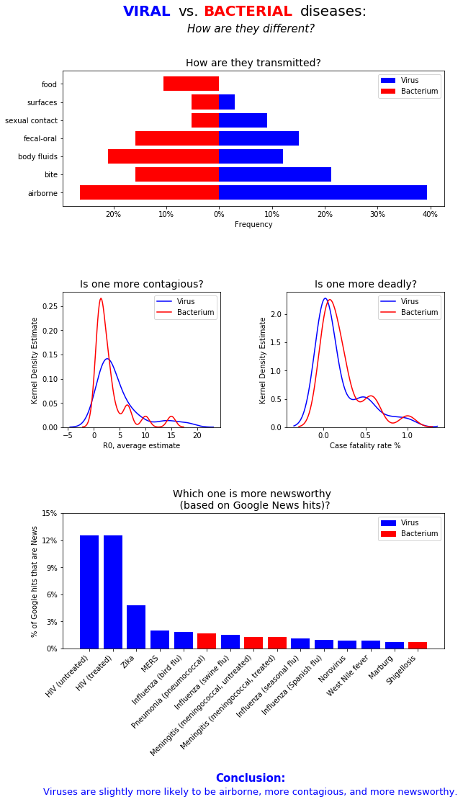

## Viruses vs. Bacteria
Jessica Hoban
August 30th, 2020

#### Purpose
The included Jupyter Notebook creates the following static dashboard:

#### Explanation of visualization: 
The overall purpose of this static dashboard is to explore the differences between viral and bacterial diseases. We first look to see if they are transmitted differently, and can see that viruses tend to be airborne more often and food-borne less often than bacteria. We then overlay KDE plots for both pathogen types, showing their distribution of contagiousness (R0 average estimate). We see that viruses tend to be only slightly more contagious. Performing a similar KDE plot comparison for deadliness (case fatality rate), we see that they are very similar in this regard, with bacteria being only mildly deadlier. Finally, we look at the top 15 diseases based on their newsworthiness (% of Google hits classified as Google News) and colored by their pathogen type. Based on the fact that 11 out of 15 of the bars are blue, we can infer that viruses tend to get more press coverage. We then summarize all of this briefly in a Conclusion annotation at the bottom of the dashboard.

#### Conclusion: 
Viruses are slightly more likely to be airborne, more contagious, and more newsworthy.
